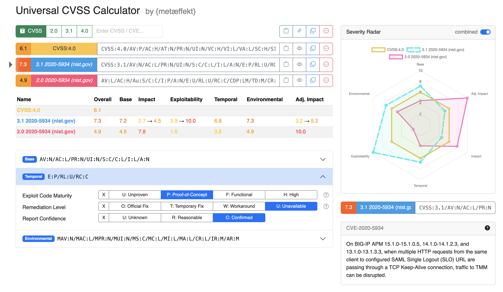

# {metæffekt} CVSS Calculator

The {metæffekt} CVSS Calculator
([live demo](https://www.metaeffekt.com/security/cvss/calculator/index.html?vector=%5B%5B%22CVSS%3A4.0%22%2Ctrue%2C%22CVSS%3A4.0%2FAV%3AP%2FAC%3AL%2FAT%3AN%2FPR%3AN%2FUI%3AN%2FVC%3AH%2FVI%3AL%2FVA%3AL%2FSC%3AH%2FSI%3AH%2FSA%3AH%22%2C%22CVSS%3A4.0%22%5D%2C%5B%223.1+2020-5934+%28nist.gov%29%22%2Ctrue%2C%22CVSS%3A3.1%2FAV%3AN%2FAC%3AL%2FPR%3AL%2FUI%3AN%2FS%3AC%2FC%3AH%2FI%3AL%2FA%3AH%2FE%3AF%2FRL%3AU%2FRC%3AR%22%2C%22CVSS%3A3.1%22%5D%2C%5B%222.0+2020-5934+%28nist.gov%29%22%2Ctrue%2C%22AV%3AL%2FAC%3AH%2FAu%3AS%2FC%3AC%2FI%3AP%2FA%3AN%2FE%3AU%2FRL%3AU%2FRC%3AC%2FCDP%3ALM%2FTD%3AM%2FCR%3AH%2FIR%3AH%2FAR%3AH%22%2C%22CVSS%3A2.0%22%5D%5D&open=temporal&selected=3.1+2020-5934+%28nist.gov%29))
is a web application that allows to calculate CVSS scores for multiple CVSS vectors of
different versions simultaneously. It is implemented in TypeScript and can be used as a library.



## TypeScript Library

See [README.md](ae-cvss-calculator/README.md) in the `ae-cvss-calculator` directory for instructions on how to build and
use the library.

## UI

- A UI implementation can be found in the [site](site) directory.
- The implementation is live on
  [https://www.metaeffekt.com/security/cvss/calculator](https://www.metaeffekt.com/security/cvss/calculator/index.html?vector=%5B%5B%22CVSS%3A4.0%22%2Ctrue%2C%22CVSS%3A4.0%2FAV%3AP%2FAC%3AL%2FAT%3AN%2FPR%3AN%2FUI%3AN%2FVC%3AH%2FVI%3AL%2FVA%3AL%2FSC%3AH%2FSI%3AH%2FSA%3AH%22%2C%22CVSS%3A4.0%22%5D%2C%5B%223.1+2020-5934+%28nist.gov%29%22%2Ctrue%2C%22CVSS%3A3.1%2FAV%3AN%2FAC%3AL%2FPR%3AL%2FUI%3AN%2FS%3AC%2FC%3AH%2FI%3AL%2FA%3AH%2FE%3AF%2FRL%3AU%2FRC%3AR%22%2C%22CVSS%3A3.1%22%5D%2C%5B%222.0+2020-5934+%28nist.gov%29%22%2Ctrue%2C%22AV%3AL%2FAC%3AH%2FAu%3AS%2FC%3AC%2FI%3AP%2FA%3AN%2FE%3AU%2FRL%3AU%2FRC%3AC%2FCDP%3ALM%2FTD%3AM%2FCR%3AH%2FIR%3AH%2FAR%3AH%22%2C%22CVSS%3A2.0%22%5D%5D&open=temporal&selected=3.1+2020-5934+%28nist.gov%29)
- See the usage instructions in the UI to learn how to use the calculator.

### URL Parameters

The calculator supports the following URL parameters.
Make sure to properly URL encode the values.

#### vector

The `vector` parameter is a JSON array of JSON arrays. Each sub-array is of the following format:

```json
[
  "vector name",
  true,
  "CVSS:3.1/AV:N/AC:L/PR:N/UI:N/S:C/C:H/I:L/A:N",
  "CVSS:3.1"
]
```

Where the first element is the name of the vector, the second element is a boolean indicating whether the vector is
visible, the third element is the CVSS vector string and the fourth element is the CVSS version string.
The CVSS version is one of `CVSS:2.0`, `CVSS:3.1` or `CVSS:4.0`.

Example with a larger amount of vectors:

```
vector=[["CVSS:4.0",true,"CVSS:4.0/AV:P/AC:L/AT:N/PR:N/UI:N/VC:H/VI:L/VA:L/SC:H/SI:H/SA:H","CVSS:4.0"],["3.1+2020-5934+(nist.gov)",true,"CVSS:3.1/AV:N/AC:L/PR:L/UI:N/S:C/C:H/I:L/A:H/E:F/RL:U/RC:R","CVSS:3.1"],["2.0+2020-5934+(nist.gov)",true,"AV:L/AC:H/Au:S/C:C/I:P/A:N/E:U/RL:U/RC:C/CDP:LM/TD:M/CR:H/IR:H/AR:H","CVSS:2.0"]]
```

#### open

The `open` parameter is a string indicating which accordion elements are expanded.
They are normalized to a lowercase representation, where spaces are replaced by dashes `-` and individual elements are
separated by commas.
See the names of the individual categories for the possible values.

Example:

```
open=temporal,environmental-security-requirement
```

#### selected

The `selected` parameter is a string indicating which vector is selected for editing.
If set, it must be the name of one of the vectors in the `vector` parameter.

Example:

```
selected=3.1+2020-5934+(nist.gov)
```

#### cve

The `cve` parameter is a string indicating a comma separated list of CVE IDs.
If set, the calculator will automatically fetch the CVSS vectors from the NVD API and add them to the list of vectors.

Example:

```
cve=CVE-2020-5934,CVE-2020-5935
```

### NVD Integration

Using the NVD input field at the top of the editor, you can enter a CVE ID and the calculator will automatically fetch
the CVSS vector(s) from the NVD API and add it to the list of vectors.

When selecting a vector sourced from the NVD, the according description will be displayed below the Severity Radar
chart.
This description is either fetched as part of the initial NVD API call or, if the vector was added via the URL
parameter, fetched when selecting the vector.
