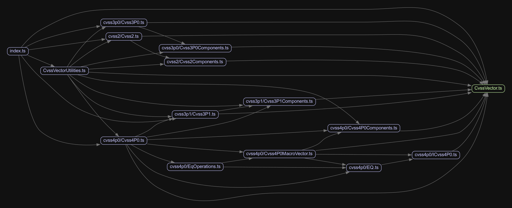

<div align="center">
	<h1>{metæffekt} CVSS Calculator</h1>
    <a href="https://www.npmjs.com/package/ae-cvss-calculator"></a>
	
</div>

<br>

The {metæffekt} CVSS Calculator supports all versions of the CVSS standard by FIRST to model CVSS vectors and calculate
their scores.
It consists of the following components:

<table>
  <tr>
    <td align="center">
      <b>TypeScript Library</b>
    </td>
    <td align="center">
      <b>UI</b>
    </td>
  </tr>
  <tr>
    <td>
      Supports CVSS versions 2.0, 3.0, 3.1 and 4.0.
      Available on NPM as <a target="_blank" href="https://www.npmjs.com/package/ae-cvss-calculator">ae-cvss-calculator</a> and installable via:
      <pre>npm install ae-cvss-calculator</pre>
    </td>
    <td>
      <p>
        The calculator is available on <a target="_blank" href="https://www.metaeffekt.com/security/cvss/calculator/index.html?vector=%5B%5B%22CVSS%3A4.0%22%2Ctrue%2C%22CVSS%3A4.0%2FAV%3AP%2FAC%3AL%2FAT%3AN%2FPR%3AN%2FUI%3AN%2FVC%3AH%2FVI%3AL%2FVA%3AL%2FSC%3AH%2FSI%3AH%2FSA%3AH%22%2C%22CVSS%3A4.0%22%5D%2C%5B%223.1+2020-5934+%28nist.gov%29%22%2Ctrue%2C%22CVSS%3A3.1%2FAV%3AN%2FAC%3AL%2FPR%3AL%2FUI%3AN%2FS%3AC%2FC%3AH%2FI%3AL%2FA%3AH%2FE%3AF%2FRL%3AU%2FRC%3AR%22%2C%22CVSS%3A3.1%22%5D%2C%5B%222.0+2020-5934+%28nist.gov%29%22%2Ctrue%2C%22AV%3AL%2FAC%3AH%2FAu%3AS%2FC%3AC%2FI%3AP%2FA%3AN%2FE%3AU%2FRL%3AU%2FRC%3AC%2FCDP%3ALM%2FTD%3AM%2FCR%3AH%2FIR%3AH%2FAR%3AH%22%2C%22CVSS%3A2.0%22%5D%5D&open=temporal&selected=3.1+2020-5934+%28nist.gov%29">our webpage</a> for you to try out and link from your applications.
        The source code can be found in the <a href="https://github.com/org-metaeffekt/metaeffekt-universal-cvss-calculator/tree/master/site">site</a> directory.
      </p>
    </td>
  </tr>
</table>

## Installation

This project implements the following versions of the CVSS standard by FIRST:

- [CVSS:2.0 - https://www.first.org/cvss/v2/guide](https://www.first.org/cvss/v2/guide)
- [CVSS:3.0 - https://www.first.org/cvss/v3.0/specification-document](https://www.first.org/cvss/v3.0/specification-document)
- [CVSS:3.1 - https://www.first.org/cvss/v3.1/specification-document](https://www.first.org/cvss/v3.1/specification-document)
- [CVSS:4.0 - https://www.first.org/cvss/v4.0/specification-document](https://www.first.org/cvss/v4.0/specification-document)

Available on NPM as [ae-cvss-calculator](https://www.npmjs.com/package/ae-cvss-calculator) and installable via:

```bash
npm install ae-cvss-calculator
```

## Usage

The CVSS versions are implemented in the following classes:

- [Cvss2.ts](https://github.com/org-metaeffekt/metaeffekt-universal-cvss-calculator/blob/master/ae-cvss-calculator/src/cvss2/Cvss2.ts)
- [Cvss3P0.ts](https://github.com/org-metaeffekt/metaeffekt-universal-cvss-calculator/blob/master/ae-cvss-calculator/src/cvss3p0/Cvss3P0.ts)
- [Cvss3P1.ts](https://github.com/org-metaeffekt/metaeffekt-universal-cvss-calculator/blob/master/ae-cvss-calculator/src/cvss3p1/Cvss3P1.ts)
- [Cvss4P0.ts](https://github.com/org-metaeffekt/metaeffekt-universal-cvss-calculator/blob/master/ae-cvss-calculator/src/cvss4p0/Cvss4P0.ts)



A couple of examples, using the methods that can construct and modify vectors and calculate the several
different CVSS scores:

#### Usage V4.0

```ts
const cvss4 = new Cvss4P0()
cvss4.applyVector('CVSS:4.0/AV:A/AC:L/AT:N/PR:N/UI:N/VC:L/VI:L/VA:L')
cvss4.applyVector('SC:L/SI:L/SA:L')
console.log(cvss4.toString())
```

```
CVSS:4.0/AV:A/AC:L/AT:N/PR:N/UI:N/VC:L/VI:L/VA:L/SC:L/SI:L/SA:L
```

---

```ts
const cvss4 = new Cvss4P0('CVSS:4.0/AV:A/AC:L/AT:N/PR:N/UI:N/VC:L/VI:L/VA:L/SC:L/SI:L/SA:L')
cvss4.applyComponentString('MAC', 'L')
cvss4.applyComponent(Cvss4P0Components.AC, Cvss4P0Components.AC_VALUES.H) // alternatively via types
const scores = cvss4.calculateScores()
console.log(scores)
```

```json
{
  "overall": 5.3,
  "vector": "CVSS:4.0/AV:A/AC:H/AT:N/PR:N/UI:N/VC:L/VI:L/VA:L/SC:L/SI:L/SA:L/MAV:X/MAC:L/MAT:X/MPR:X/MUI:X/MVC:X/MVI:X/MVA:X/MSC:X/MSI:X/MSA:X"
}
```

#### Usage V3.1

```ts
const cvss3 = new Cvss3P1('CVSS:3.1/AV:N/AC:H/PR:N/UI:N/S:U/C:L/I:L/A:L')
cvss3.applyComponentString("AC", "L")
console.log(cvss3.calculateScores(false))
console.log(cvss3.calculateScores(true)) // normalize all scores to a scale 0-10 (CVSS:3.1 Exploitability, Impact)
```

```json
{
  "base": 7.3,
  "impact": 3.4,
  "exploitability": 3.9,
  "temporal": null,
  "environmental": null,
  "modifiedImpact": null,
  "overall": 7.3,
  "vector": "CVSS:3.1/AV:N/AC:L/PR:N/UI:N/S:U/C:L/I:L/A:L"
}
```

```json
{
  "base": 7.3,
  "impact": 5.7,
  "exploitability": 10,
  "temporal": null,
  "environmental": null,
  "modifiedImpact": null,
  "overall": 7.3,
  "vector": "CVSS:3.1/AV:N/AC:L/PR:N/UI:N/S:U/C:L/I:L/A:L"
}
```

### Build

```bash
git clone https://github.com/org-metaeffekt/metaeffekt-universal-cvss-calculator
cd metaeffekt-universal-cvss-calculator/ae-cvss-calculator
npm install
npm run build
```

The minified `ae-cvss-calculator.js` can be found in the `dist` directory.

Otherwise, you can also build the packaged version by running

```bash
npm run pack
```

To publish a new version:

1. Make sure that you pushed all the code related to the release, including the version bump to git, as npm will fetch
   that state for the release.
2. Ensure that you removed all target folders (`dist`) and bundles (`ae-cvss-calculator-1.0.9.tgz`).
3. Run the following commands:

```bash
npm login
npm run pack
npm publish
```

4. Update the dependency in Artifact Analysis in the VAD.
